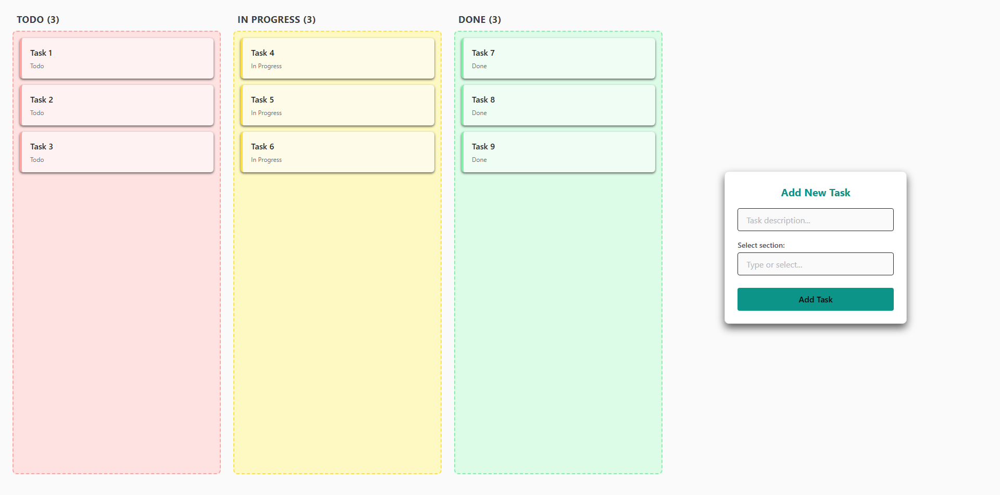

# 📋 Kanban Board

A simple and interactive Kanban Board built with **React**, **TypeScript**, **Chakra UI**, and **DND Kit** to manage tasks efficiently.

---

## 📽️ Watch the Demo

Check out the live demo of the Kanban Board in action on my [LinkedIn post](https://www.linkedin.com/feed/update/urn:li:activity:7353271667952861184/)!

---

## 📸 Preview

  

---

## 🚀 Features

- 🟦 **Drag-and-Drop Tasks**: Move tasks between boards (To Do, In Progress, Done) using drag-and-drop.
- ➕ **Add New Tasks**: Easily add new tasks to any board.
- 🗂️ **Task Counter**: Live count of tasks in each board.
- 🎯 **Interactive UI**: Smooth animations and responsive design.
- 🔄 **Instant Updates**: Changes reflect immediately without reloads.

---

## ⚙️ Tech Stack

- **React + TypeScript** — UI development and type safety  
- **Vite** — Fast and modern build tool  
- **Chakra UI** — Accessible and customizable component library  
- **DND Kit** — Lightweight drag-and-drop functionality

---
